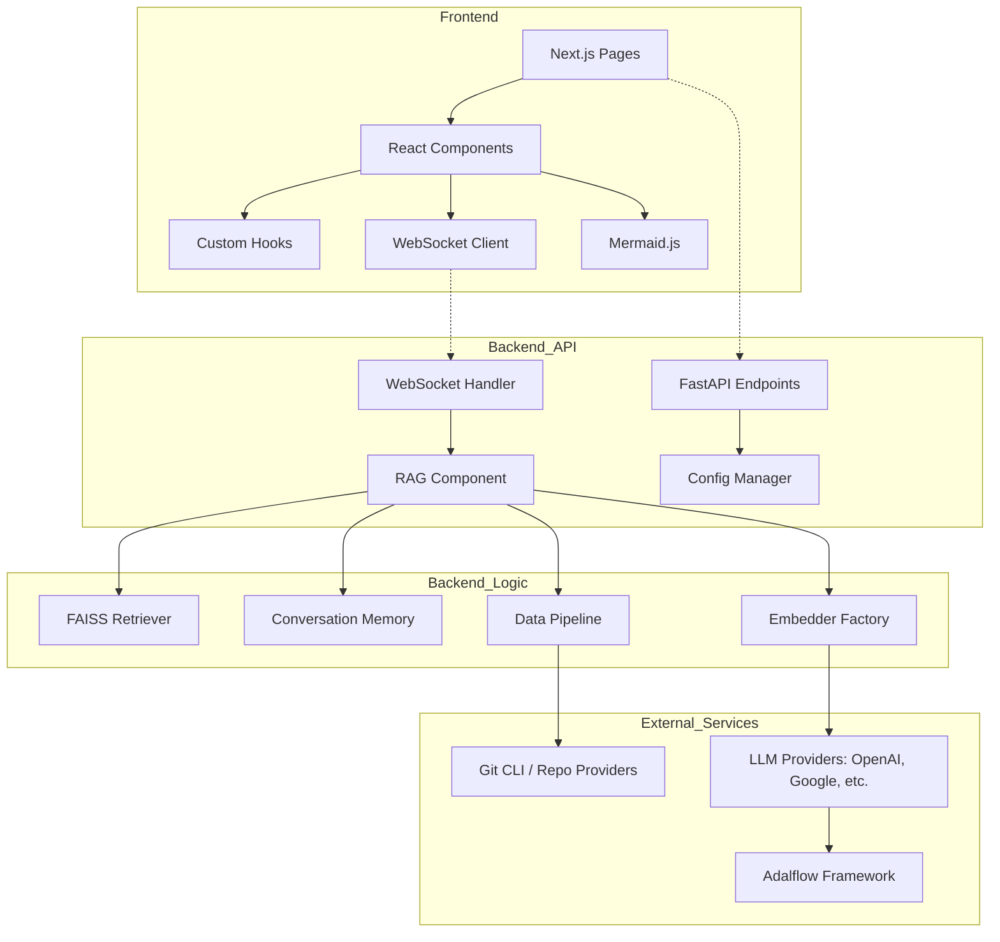

# Dependency Analysis

## Internal Dependencies Map

The project follows a clear separation between the frontend (Next.js) and the backend (FastAPI), with a layered architecture in the backend to handle RAG (Retrieval-Augmented Generation) and data processing.

### Backend (Python)
- **Entry Point**: `api/main.py` initializes the environment and starts the `uvicorn` server, importing the FastAPI app from `api/api.py`.
- **API Layer**: `api/api.py` defines REST endpoints for configuration, authentication, and project management. It delegates real-time chat to `api/websocket_wiki.py`.
- **WebSocket Layer**: `api/websocket_wiki.py` handles bidirectional communication for chat, instantiating the `RAG` component for each session.
- **Logic Layer (RAG)**: `api/rag.py` contains the core RAG logic using the `adalflow` framework. It relies on:
    - `api/data_pipeline.py`: For repository cloning, document processing, and database management.
    - `api/tools/embedder.py`: A factory for creating embedder instances.
    - `api/prompts.py`: Centralized storage for system prompts and templates.
- **Data Layer**: `api/data_pipeline.py` manages the lifecycle of repository data, from `git clone` to tokenization and embedding.
- **Client Layer**: `api/config.py` maps provider IDs to specific client implementations (e.g., `OpenAIClient`, `GoogleGenAIClient`). Custom clients are located in `api/*_client.py`.

### Frontend (TypeScript/Next.js)
- **App Router**: `src/app` contains the page definitions.
    - `page.tsx`: Landing page and repository configuration.
    - `[owner]/[repo]/page.tsx`: Main wiki view.
- **Components**: `src/components` contains reusable UI elements.
    - `Ask.tsx`: Chat interface, uses `src/utils/websocketClient.ts`.
    - `WikiTreeView.tsx`: Navigation for the generated wiki.
    - `Mermaid.tsx`: Renders architecture diagrams using the `mermaid` library.
- **State & Logic**:
    - `src/contexts/LanguageContext.tsx`: Manages i18n state.
    - `src/hooks/useProcessedProjects.ts`: Fetches and manages the list of analyzed repositories.
    - `src/utils/websocketClient.ts`: Encapsulates WebSocket logic for backend communication.

## External Libraries Analysis

### Backend (Python)
- **Core Framework**: `adalflow` (LLM/RAG orchestration), `fastapi` (Web API), `uvicorn` (ASGI server).
- **LLM SDKs**: `google-generativeai`, `openai`, `ollama`, `boto3` (AWS Bedrock), `azure-identity`, `azure-core`.
- **Data Processing**: `faiss-cpu` (Vector DB), `tiktoken` (Token counting), `numpy`, `langid` (Language detection).
- **Utilities**: `pydantic` (Data validation), `python-dotenv` (Env management), `aiohttp` (Async HTTP), `websockets` (WebSocket protocol).

### Frontend (React/Next.js)
- **Framework**: `next` (v15.3.1), `react` (v19).
- **Visualization**: `mermaid` (Diagrams), `svg-pan-zoom`.
- **Content Rendering**: `react-markdown`, `rehype-raw`, `remark-gfm`, `react-syntax-highlighter`.
- **Internationalization**: `next-intl`.
- **Styling**: `tailwindcss`, `next-themes`.

## Service Integrations

- **LLM Providers**:
    - **Google**: Gemini models via `google-generativeai`.
    - **OpenAI**: GPT models via `openai`.
    - **OpenRouter**: Aggregator for various models.
    - **Ollama**: Local LLM execution.
    - **AWS Bedrock**: Enterprise LLM access.
    - **Azure AI**: Microsoft's AI services.
    - **DashScope**: Alibaba Cloud's AI models.
- **Git Platforms**:
    - **GitHub/GitLab/Bitbucket**: Integrated via `git` CLI for cloning and personal access tokens for private repo access.

## Dependency Injection Patterns

- **Factory Pattern**: The backend uses a factory pattern for creating LLM clients and embedders. `api/config.py` maintains a mapping of client classes, and `api/tools/embedder.py` provides a `get_embedder` function that resolves the correct instance based on environment configuration.
- **Adalflow Components**: The `RAG` class in `api/rag.py` inherits from `adal.Component`, allowing it to compose other `adalflow` building blocks (like `FAISSRetriever` and `Memory`) in a declarative manner.
- **Context Providers**: The frontend uses React Context (`LanguageContext`) to inject internationalization state and functions throughout the component tree.

## Module Coupling Assessment

- **Backend Modularity**: High. The separation of clients, data pipeline, and RAG logic allows for easy addition of new LLM providers or data sources.
- **Frontend-Backend Coupling**: Moderate. The frontend is coupled to the backend's API schema (Pydantic models). Changes in backend models (e.g., `WikiPage`, `RepoInfo`) require manual updates to TypeScript interfaces in `src/types`.
- **Framework Coupling**: High. The backend is deeply integrated with `adalflow`. While this provides powerful RAG capabilities, it makes the core logic dependent on the `adalflow` API.
- **Cohesion**: High. Each module has a well-defined responsibility (e.g., `data_pipeline.py` only handles data ingestion and processing).

## Dependency Graph

## Potential Dependency Issues

- **Adalflow Versioning**: The project relies on `adalflow >= 0.1.0`. As a relatively new framework, breaking changes in `adalflow` could significantly impact the `RAG` and `DataPipeline` implementations.
- **Duplicate Model Definitions**: Data models are defined in Python (Pydantic) and TypeScript. This duplication increases the risk of desynchronization during API updates.
- **Manual Client Mapping**: The mapping of providers to client classes in `api/config.py` is manual. While functional, it requires code changes to support new providers even if they follow standard protocols (like OpenAI-compatible APIs).
- **Local Environment Dependencies**: The backend relies on the `git` binary being present in the system path for repository cloning, which might cause issues in restricted container environments if not properly configured.