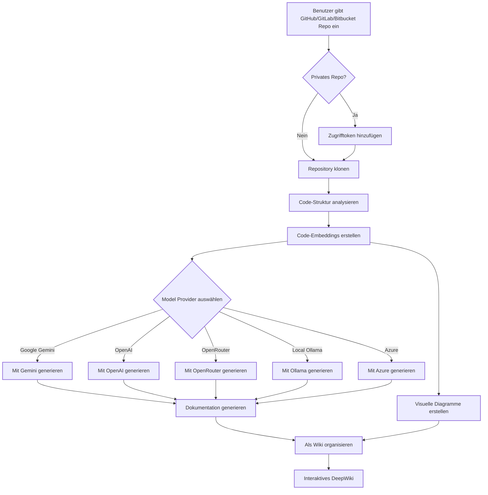
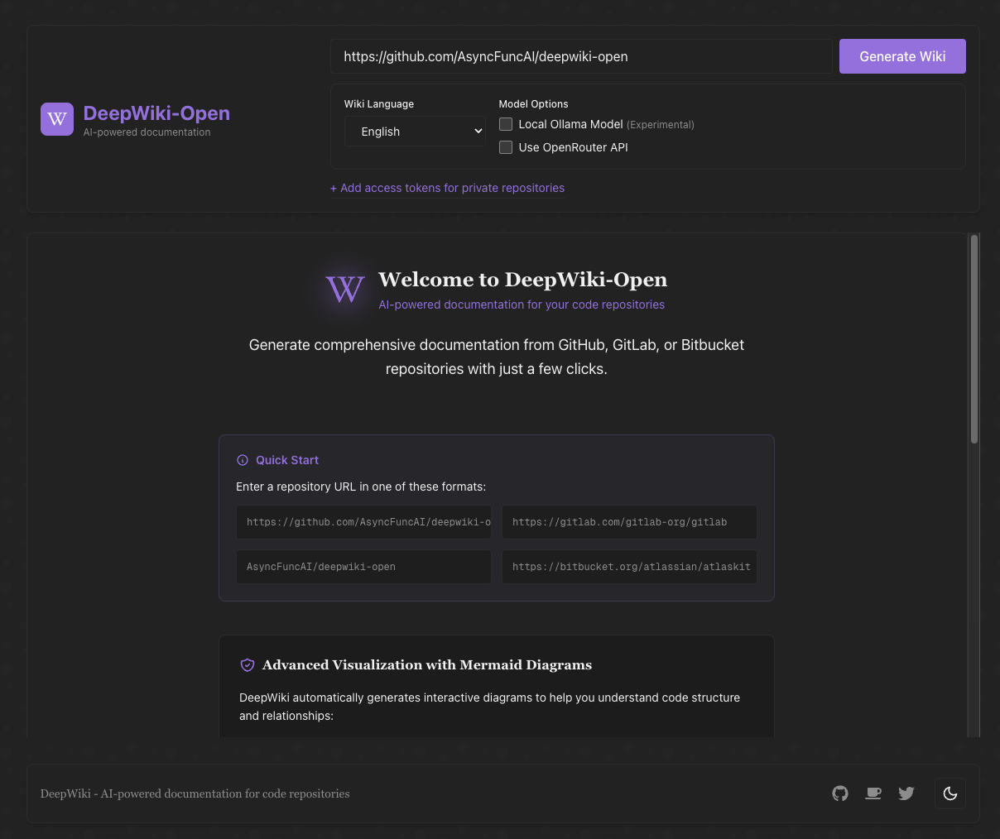
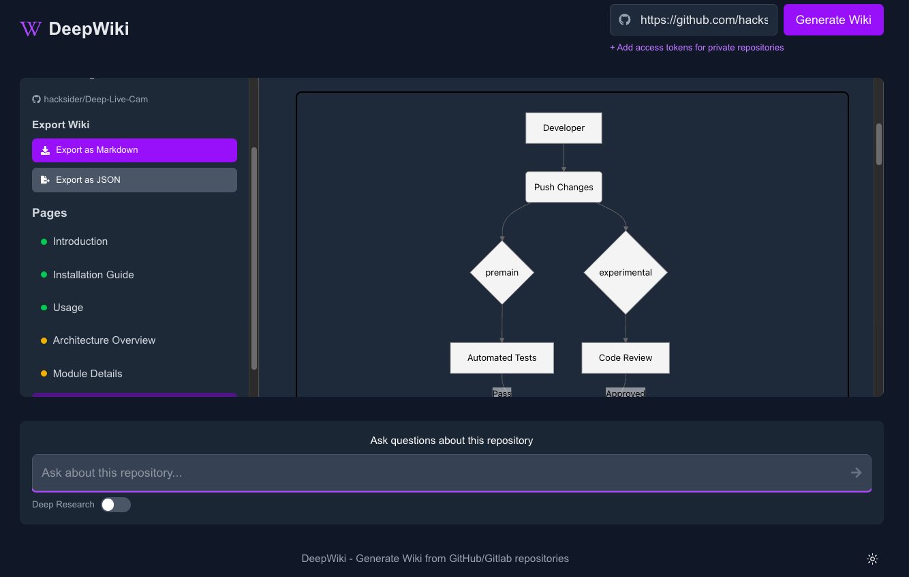

# DeepWiki-Open


**DeepWiki** ist mein eigener Implementierungsversuch von DeepWiki, das automatisch wunderschöne, interaktive Wikis für jedes GitHub-, GitLab- oder Bitbucket-Repository erstellt! Geben Sie einfach einen Repository-Namen ein, und DeepWiki wird:

1. Die Code-Struktur analysieren
2. Umfassende Dokumentation generieren
3. Visuelle Diagramme erstellen, um die Funktionsweise zu erklären
4. Alles in einem leicht zu navigierenden Wiki organisieren

[](https://buymeacoffee.com/sheing)
[](https://tip.md/sng-asyncfunc)
[](https://x.com/sashimikun_void)
[](https://discord.com/invite/VQMBGR8u5v)

[English](./README.md) | [简体中文](./README.zh.md) | [繁體中文](./README.zh-tw.md) | [日本語](./README.ja.md) | [Español](./README.es.md) | [한국어](./README.kr.md) | [Tiếng Việt](./README.vi.md) | [Português Brasileiro](./README.pt-br.md) | [Français](./README.fr.md) | [Русский](./README.ru.md) | [Deutsch](./README.de.md)

## ✨ Features

- **Instant-Dokumentation**: Verwandeln Sie jedes GitHub-, GitLab- oder Bitbucket-Repository in Sekunden in ein Wiki
- **Unterstützung für private Repositories**: Sicherer Zugriff auf private Repositories mit persönlichen Zugriffstokens
- **Intelligente Analyse**: KI-gestütztes Verständnis von Code-Struktur und Beziehungen
- **Wunderschöne Diagramme**: Automatische Mermaid-Diagramme zur Visualisierung von Architektur und Datenfluss
- **Einfache Navigation**: Einfache, intuitive Benutzeroberfläche zum Erkunden des Wikis
- **Frage-Feature**: Chatten Sie mit Ihrem Repository mithilfe von KI-gestütztem RAG für genaue Antworten
- **DeepResearch**: Mehrteiliger Rechercheprozess, der komplexe Themen gründlich untersucht
- **Mehrere Model-Provider**: Unterstützung für Google Gemini, OpenAI, OpenRouter und lokale Ollama-Modelle
- **Flexible Embeddings**: Wählen Sie zwischen OpenAI, Google AI oder lokalen Ollama-Embeddings für optimale Leistung

## 🚀 Schnellstart (Sehr einfach!)

### Option 1: Mit Docker

```bash
# Repository klonen
git clone https://github.com/AsyncFuncAI/deepwiki-open.git
cd deepwiki-open

# Erstellen Sie eine .env-Datei mit Ihren API-Schlüsseln
echo "GOOGLE_API_KEY=your_google_api_key" > .env
echo "OPENAI_API_KEY=your_openai_api_key" >> .env
# Optional: Verwenden Sie Google AI Embeddings statt OpenAI (empfohlen bei Google-Modellen)
echo "DEEPWIKI_EMBEDDER_TYPE=google" >> .env
# Optional: Fügen Sie OpenRouter API-Schlüssel hinzu, wenn Sie OpenRouter-Modelle verwenden möchten
echo "OPENROUTER_API_KEY=your_openrouter_api_key" >> .env
# Optional: Fügen Sie Ollama-Host hinzu, wenn nicht lokal. Standard: http://localhost:11434
echo "OLLAMA_HOST=your_ollama_host" >> .env
# Optional: Fügen Sie Azure API-Schlüssel, Endpoint und Version hinzu, wenn Sie Azure OpenAI-Modelle verwenden möchten
echo "AZURE_OPENAI_API_KEY=your_azure_openai_api_key" >> .env
echo "AZURE_OPENAI_ENDPOINT=your_azure_openai_endpoint" >> .env
echo "AZURE_OPENAI_VERSION=your_azure_openai_version" >> .env
# Starten Sie mit Docker Compose
docker-compose up
```

Detaillierte Anweisungen zur Verwendung von DeepWiki mit Ollama und Docker finden Sie unter [Ollama-Anweisungen](Ollama-instruction.md).

> 💡 **Wo erhalten Sie diese Schlüssel:**
> - Holen Sie sich einen Google API-Schlüssel von [Google AI Studio](https://makersuite.google.com/app/apikey)
> - Holen Sie sich einen OpenAI API-Schlüssel von [OpenAI Platform](https://platform.openai.com/api-keys)
> - Holen Sie sich Azure OpenAI-Anmeldedaten von [Azure Portal](https://portal.azure.com/) - erstellen Sie eine Azure OpenAI-Ressource und rufen Sie den API-Schlüssel, Endpoint und API-Version ab

### Option 2: Manuelle Einrichtung (Empfohlen)

#### Schritt 1: Richten Sie Ihre API-Schlüssel ein

Erstellen Sie eine `.env`-Datei im Projekt-Stammverzeichnis mit diesen Schlüsseln:

```
GOOGLE_API_KEY=your_google_api_key
OPENAI_API_KEY=your_openai_api_key
# Optional: Verwenden Sie Google AI Embeddings (empfohlen bei Google-Modellen)
DEEPWIKI_EMBEDDER_TYPE=google
# Optional: Fügen Sie dies hinzu, wenn Sie OpenRouter-Modelle verwenden möchten
OPENROUTER_API_KEY=your_openrouter_api_key
# Optional: Fügen Sie dies hinzu, wenn Sie Azure OpenAI-Modelle verwenden möchten
AZURE_OPENAI_API_KEY=your_azure_openai_api_key
AZURE_OPENAI_ENDPOINT=your_azure_openai_endpoint
AZURE_OPENAI_VERSION=your_azure_openai_version
# Optional: Fügen Sie Ollama-Host hinzu, wenn nicht lokal. Standard: http://localhost:11434
OLLAMA_HOST=your_ollama_host
```

#### Schritt 2: Starten Sie das Backend

```bash
# Installieren Sie Python-Abhängigkeiten
python -m pip install poetry==1.8.2 && poetry install -C api

# Starten Sie den API-Server
python -m api.main
```

#### Schritt 3: Starten Sie das Frontend

```bash
# Installieren Sie JavaScript-Abhängigkeiten
npm install
# oder
yarn install

# Starten Sie die Web-App
npm run dev
# oder
yarn dev
```

#### Schritt 4: Verwenden Sie DeepWiki!

1. Öffnen Sie [http://localhost:3000](http://localhost:3000) in Ihrem Browser
2. Geben Sie ein GitHub-, GitLab- oder Bitbucket-Repository ein (wie `https://github.com/openai/codex`, `https://github.com/microsoft/autogen`, `https://gitlab.com/gitlab-org/gitlab` oder `https://bitbucket.org/redradish/atlassian_app_versions`)
3. Für private Repositories klicken Sie auf "+ Zugriffstokens hinzufügen" und geben Sie Ihren persönlichen GitHub- oder GitLab-Zugrifftoken ein
4. Klicken Sie auf "Wiki generieren" und sehen Sie die Magie geschehen!

## 🔍 Wie es funktioniert

DeepWiki verwendet KI zum:

1. Klonen und Analysieren des GitHub-, GitLab- oder Bitbucket-Repositorys (einschließlich privater Repos mit Token-Authentifizierung)
2. Erstellen von Code-Embeddings für intelligente Abfrage
3. Generieren von Dokumentation mit kontextbewusster KI (mit Google Gemini, OpenAI, OpenRouter, Azure OpenAI oder lokalen Ollama-Modellen)
4. Erstellen von visuellen Diagrammen zur Erklärung von Code-Beziehungen
5. Organisieren alles in ein strukturiertes Wiki
6. Ermöglichen intelligenter Fragen und Antworten mit dem Repository über die Ask-Funktion
7. Bereitstellung von umfassenden Forschungsfähigkeiten mit DeepResearch



## 🛠️ Projektstruktur

```
deepwiki/
├── api/                  # Backend API-Server
│   ├── main.py           # API-Einstiegspunkt
│   ├── api.py            # FastAPI-Implementierung
│   ├── rag.py            # Retrieval Augmented Generation
│   ├── data_pipeline.py  # Datenverarbeitungsprogramme
│   └── requirements.txt  # Python-Abhängigkeiten
│
├── src/                  # Frontend Next.js App
│   ├── app/              # Next.js App-Verzeichnis
│   │   └── page.tsx      # Hauptanwendungsseite
│   └── components/       # React-Komponenten
│       └── Mermaid.tsx   # Mermaid-Diagramm-Renderer
│
├── public/               # Statische Ressourcen
├── package.json          # JavaScript-Abhängigkeiten
└── .env                  # Umgebungsvariablen (erstellen Sie diese)
```

## 🤖 Provider-basiertes Modellauswahlsystem

DeepWiki implementiert nun ein flexibles, provider-basiertes Modellauswahlsystem, das mehrere LLM-Provider unterstützt:

### Unterstützte Provider und Modelle

- **Google**: Standard `gemini-2.5-flash`, unterstützt auch `gemini-2.5-flash-lite`, `gemini-2.5-pro`, etc.
- **OpenAI**: Standard `gpt-5-nano`, unterstützt auch `gpt-5`, `4o`, etc.
- **OpenRouter**: Zugriff auf mehrere Modelle über eine einheitliche API, einschließlich Claude, Llama, Mistral, etc.
- **Azure OpenAI**: Standard `gpt-4o`, unterstützt auch `o4-mini`, etc.
- **Ollama**: Unterstützung für lokal laufende Open-Source-Modelle wie `llama3`

### Umgebungsvariablen

Jeder Provider benötigt seine entsprechenden API-Schlüssel-Umgebungsvariablen:

```
# API-Schlüssel
GOOGLE_API_KEY=your_google_api_key        # Erforderlich für Google Gemini-Modelle
OPENAI_API_KEY=your_openai_api_key        # Erforderlich für OpenAI-Modelle
OPENROUTER_API_KEY=your_openrouter_api_key # Erforderlich für OpenRouter-Modelle
AZURE_OPENAI_API_KEY=your_azure_openai_api_key  # Erforderlich für Azure OpenAI-Modelle
AZURE_OPENAI_ENDPOINT=your_azure_openai_endpoint  # Erforderlich für Azure OpenAI-Modelle
AZURE_OPENAI_VERSION=your_azure_openai_version  # Erforderlich für Azure OpenAI-Modelle

# OpenAI API Base URL Konfiguration
OPENAI_BASE_URL=https://custom-api-endpoint.com/v1  # Optional, für benutzerdefinierte OpenAI API Endpoints

# Ollama Host
OLLAMA_HOST=your_ollama_host # Optional, wenn Ollama nicht lokal ist. Standard: http://localhost:11434

# Konfigurationsverzeichnis
DEEPWIKI_CONFIG_DIR=/path/to/custom/config/dir  # Optional, für benutzerdefinierten Konfigurationsdatei-Speicherort
```

### Konfigurationsdateien

DeepWiki verwendet JSON-Konfigurationsdateien zur Verwaltung verschiedener Aspekte des Systems:

1. **`generator.json`**: Konfiguration für Textgenerierungsmodelle
   - Definiert verfügbare Model-Provider (Google, OpenAI, OpenRouter, Azure, Ollama)
   - Gibt Standard- und verfügbare Modelle für jeden Provider an
   - Enthält modellspezifische Parameter wie Temperatur und top_p

2. **`embedder.json`**: Konfiguration für Embedding-Modelle und Textverarbeitung
   - Definiert Embedding-Modelle für Vektorspeicherung
   - Enthält Retriever-Konfiguration für RAG
   - Gibt Text-Splitter-Einstellungen für Dokumentenaufteilung an

3. **`repo.json`**: Konfiguration für Repository-Handling
   - Enthält Dateifilter zur Ausschließung bestimmter Dateien und Verzeichnisse
   - Definiert Repository-Größenlimits und Verarbeitungsregeln

Standardmäßig befinden sich diese Dateien im Verzeichnis `api/config/`. Sie können ihren Speicherort mithilfe der Umgebungsvariable `DEEPWIKI_CONFIG_DIR` anpassen.

### Benutzerdefinierte Modellauswahl für Service-Provider

Die Funktion der benutzerdefinierten Modellauswahl ist speziell für Service-Provider gedacht, die:

- Mehrere KI-Modelloptionen Benutzern in Ihrer Organisation anbieten können
- Sich schnell an die sich schnell entwickelnde LLM-Landschaft anpassen können, ohne Code zu ändern
- Spezialisierte oder feinabgestimmte Modelle unterstützen können, die nicht in der vordefinierten Liste enthalten sind

Service-Provider können ihre Modelle implementieren, indem sie aus den vordefinierten Optionen auswählen oder benutzerdefinierte Modellbezeichner in der Frontend-Schnittstelle eingeben.

### Base URL Konfiguration für Enterprise Private Channels

Die base_url-Konfiguration des OpenAI-Clients ist hauptsächlich für Enterprise-Benutzer mit privaten API-Kanälen konzipiert. Diese Funktion:

- Ermöglicht die Verbindung zu privaten oder unternehmensweiten API-Endpoints
- Ermöglicht Organisationen die Verwendung ihrer eigenen selbst gehosteten oder benutzerdefinierten LLM-Dienste
- Unterstützt die Integration mit OpenAI API-kompatiblen Diensten von Drittanbietern

**Demnächst**: In zukünftigen Updates wird DeepWiki einen Modus unterstützen, in dem Benutzer ihre eigenen API-Schlüssel in Anfragen bereitstellen müssen. Dies ermöglicht Enterprise-Kunden mit privaten Kanälen, ihre bestehenden API-Vereinbarungen zu nutzen, ohne Anmeldedaten mit der DeepWiki-Bereitstellung zu teilen.

## 🧩 Verwendung von OpenAI-kompatiblen Embedding-Modellen (z. B. Alibaba Qwen)

Wenn Sie Embedding-Modelle verwenden möchten, die mit der OpenAI API kompatibel sind (wie Alibaba Qwen), führen Sie diese Schritte aus:

1. Ersetzen Sie den Inhalt von `api/config/embedder.json` durch den aus `api/config/embedder_openai_compatible.json`.
2. Legen Sie in Ihrer Projekt-Root `.env`-Datei die relevanten Umgebungsvariablen fest, z. B.:
   ```
   OPENAI_API_KEY=your_api_key
   OPENAI_BASE_URL=your_openai_compatible_endpoint
   ```
3. Das Programm ersetzt Platzhalter in der Datei embedder.json automatisch durch die Werte aus Ihren Umgebungsvariablen.

Dies ermöglicht es Ihnen, zu jedem OpenAI-kompatiblen Embedding-Service nahtlos zu wechseln, ohne Codeänderungen vorzunehmen.

## 🧠 Verwendung von Google AI Embeddings

DeepWiki unterstützt nun die neuesten Embedding-Modelle von Google AI als Alternative zu OpenAI-Embeddings. Dies bietet eine bessere Integration, wenn Sie bereits Google Gemini-Modelle für die Textgenerierung verwenden.

### Funktionen

- **Neuestes Modell**: Verwendet Googles `text-embedding-004` Modell
- **Gleicher API-Schlüssel**: Verwendet Ihren vorhandenen `GOOGLE_API_KEY` (keine zusätzliche Einrichtung erforderlich)
- **Bessere Integration**: Optimiert für die Verwendung mit Google Gemini-Textgenerierungsmodellen
- **Aufgabenspezifisch**: Unterstützt semantische Ähnlichkeit, Abfrage und Klassifizierungsaufgaben
- **Batch-Verarbeitung**: Effiziente Verarbeitung mehrerer Texte

### So aktivieren Sie Google AI Embeddings

**Option 1: Umgebungsvariable (Empfohlen)**

Legen Sie den Embedder-Typ in Ihrer `.env`-Datei fest:

```bash
# Ihr vorhandener Google API-Schlüssel
GOOGLE_API_KEY=your_google_api_key

# Aktivieren Sie Google AI Embeddings
DEEPWIKI_EMBEDDER_TYPE=google
```

**Option 2: Docker-Umgebung**

```bash
docker run -p 8001:8001 -p 3000:3000 \
  -e GOOGLE_API_KEY=your_google_api_key \
  -e DEEPWIKI_EMBEDDER_TYPE=google \
  -v ~/.adalflow:/root/.adalflow \
  ghcr.io/asyncfuncai/deepwiki-open:latest
```

**Option 3: Docker Compose**

Fügen Sie zu Ihrer `.env`-Datei hinzu:

```bash
GOOGLE_API_KEY=your_google_api_key
DEEPWIKI_EMBEDDER_TYPE=google
```

Dann führen Sie aus:

```bash
docker-compose up
```

### Verfügbare Embedder-Typen

| Typ | Beschreibung | API-Schlüssel erforderlich | Notizen |
|------|-------------|------------------|-------|
| `openai` | OpenAI Embeddings (Standard) | `OPENAI_API_KEY` | Verwendet das `text-embedding-3-small` Modell |
| `google` | Google AI Embeddings | `GOOGLE_API_KEY` | Verwendet das `text-embedding-004` Modell |
| `ollama` | Lokale Ollama Embeddings | Keine | Erfordert lokale Ollama-Installation |

### Warum Google AI Embeddings verwenden?

- **Konsistenz**: Wenn Sie Google Gemini für die Textgenerierung verwenden, bieten Google-Embeddings bessere semantische Konsistenz
- **Leistung**: Googles neuestes Embedding-Modell bietet ausgezeichnete Leistung für Abrufaufgaben
- **Kosten**: Wettbewerbsfähige Preise im Vergleich zu OpenAI
- **Keine zusätzliche Einrichtung**: Verwendet denselben API-Schlüssel wie Ihre Textgenerierungsmodelle

### Wechsel zwischen Embeddern

Sie können problemlos zwischen verschiedenen Embedding-Anbietern wechseln:

```bash
# Verwenden Sie OpenAI Embeddings (Standard)
export DEEPWIKI_EMBEDDER_TYPE=openai

# Verwenden Sie Google AI Embeddings
export DEEPWIKI_EMBEDDER_TYPE=google

# Verwenden Sie lokale Ollama Embeddings
export DEEPWIKI_EMBEDDER_TYPE=ollama
```

**Hinweis**: Wenn Sie Embedder wechseln, müssen Sie möglicherweise Ihre Repository-Embeddings neu generieren, da verschiedene Modelle unterschiedliche Vektorräume erzeugen.

### Protokollierung

DeepWiki verwendet Pythons eingebautes `logging`-Modul für Diagnoseausgaben. Sie können die Ausführlichkeit und den Speicherort der Protokolldatei über Umgebungsvariablen konfigurieren:

| Variable        | Beschreibung                                                        | Standard                      |
|-----------------|--------------------------------------------------------------------|------------------------------|
| `LOG_LEVEL`     | Protokollierungsstufe (DEBUG, INFO, WARNING, ERROR, CRITICAL).      | INFO                         |
| `LOG_FILE_PATH` | Pfad zur Protokolldatei. Falls gesetzt, werden Protokolle in diese Datei geschrieben. | `api/logs/application.log`   |

Zum Aktivieren von Debug-Protokollierung und zum Weiterleiten von Protokollen zu einer benutzerdefinierten Datei:
```bash
export LOG_LEVEL=DEBUG
export LOG_FILE_PATH=./debug.log
python -m api.main
```
Oder mit Docker Compose:
```bash
LOG_LEVEL=DEBUG LOG_FILE_PATH=./debug.log docker-compose up
```

Bei Ausführung mit Docker Compose wird das Verzeichnis `api/logs` des Containers an `./api/logs` auf Ihrem Host gebunden (siehe Abschnitt `volumes` in `docker-compose.yml`), was die Persistenz von Protokolldateien über Neustarts hinweg gewährleistet.

Alternativ können Sie diese Einstellungen in Ihrer `.env`-Datei speichern:

```bash
LOG_LEVEL=DEBUG
LOG_FILE_PATH=./debug.log
```
Führen Sie dann einfach aus:

```bash
docker-compose up
```

**Überlegungen zur Sicherheit des Protokollierungspfads:** Stellen Sie in Produktionsumgebungen sicher, dass das Verzeichnis `api/logs` und alle benutzerdefinierten Protokolldateipfade mit angemessenen Dateisystem-Berechtigungen und Zugriffskontrolle gesichert sind. Die Anwendung erzwingt, dass `LOG_FILE_PATH` im Verzeichnis `api/logs` des Projekts verbleibt, um Pfaddurchquerung oder nicht autorisierte Schreibvorgänge zu verhindern.

## 🛠️ Erweiterte Einrichtung

### Umgebungsvariablen

| Variable             | Beschreibung                                                  | Erforderlich | Notiz                                                                                                     |
|----------------------|--------------------------------------------------------------|----------|----------------------------------------------------------------------------------------------------------|
| `GOOGLE_API_KEY`     | Google Gemini API-Schlüssel für KI-Generierung und Embeddings      | Nein | Erforderlich für Google Gemini-Modelle und Google AI-Embeddings                                               
| `OPENAI_API_KEY`     | OpenAI API-Schlüssel für Embeddings und Modelle                     | Bedingt | Erforderlich bei Verwendung von OpenAI-Embeddings oder -Modellen                                                            |
| `OPENROUTER_API_KEY` | OpenRouter API-Schlüssel für alternative Modelle                    | Nein | Nur erforderlich, wenn Sie OpenRouter-Modelle verwenden möchten                                                       |
| `AZURE_OPENAI_API_KEY` | Azure OpenAI API-Schlüssel                    | Nein | Nur erforderlich, wenn Sie Azure OpenAI-Modelle verwenden möchten                                                       |
| `AZURE_OPENAI_ENDPOINT` | Azure OpenAI Endpoint                    | Nein | Nur erforderlich, wenn Sie Azure OpenAI-Modelle verwenden möchten                                                       |
| `AZURE_OPENAI_VERSION` | Azure OpenAI Version                     | Nein | Nur erforderlich, wenn Sie Azure OpenAI-Modelle verwenden möchten                                                       |
| `OLLAMA_HOST`        | Ollama Host (Standard: http://localhost:11434)                | Nein | Nur erforderlich, wenn Sie einen externen Ollama-Server verwenden möchten                                                  |
| `DEEPWIKI_EMBEDDER_TYPE` | Embedder-Typ: `openai`, `google` oder `ollama` (Standard: `openai`) | Nein | Steuert, welcher Embedding-Provider verwendet werden soll                                                              |
| `PORT`               | Port für den API-Server (Standard: 8001)                      | Nein | Wenn Sie API und Frontend auf derselben Maschine hosten, stellen Sie sicher, dass Sie den Port von `SERVER_BASE_URL` entsprechend ändern |
| `SERVER_BASE_URL`    | Basis-URL für den API-Server (Standard: http://localhost:8001) | Nein |
| `DEEPWIKI_AUTH_MODE` | Setzen Sie auf `true` oder `1`, um den Autorisierungsmodus zu aktivieren. | Nein | Standardmäßig `false`. Falls aktiviert, ist `DEEPWIKI_AUTH_CODE` erforderlich. |
| `DEEPWIKI_AUTH_CODE` | Der geheime Code, der für die Wiki-Generierung erforderlich ist, wenn `DEEPWIKI_AUTH_MODE` aktiviert ist. | Nein | Wird nur verwendet, wenn `DEEPWIKI_AUTH_MODE` `true` oder `1` ist. |

**API-Schlüssel-Anforderungen:**
- Bei Verwendung von `DEEPWIKI_EMBEDDER_TYPE=openai` (Standard): `OPENAI_API_KEY` ist erforderlich
- Bei Verwendung von `DEEPWIKI_EMBEDDER_TYPE=google`: `GOOGLE_API_KEY` ist erforderlich  
- Bei Verwendung von `DEEPWIKI_EMBEDDER_TYPE=ollama`: Kein API-Schlüssel erforderlich (lokale Verarbeitung)

Andere API-Schlüssel sind nur erforderlich, wenn Modelle der entsprechenden Provider konfiguriert und verwendet werden.

## Autorisierungsmodus

DeepWiki kann so konfiguriert werden, dass es im Autorisierungsmodus ausgeführt wird, bei dem die Wiki-Generierung einen gültigen Autorisierungscode erfordert. Dies ist nützlich, wenn Sie steuern möchten, wer die Generierungsfunktion verwenden kann.
Beschränkt die Frontend-Initiierung und schützt das Löschen des Caches, verhindert aber nicht vollständig die Backend-Generierung, wenn API-Endpoints direkt aufgerufen werden.

Um den Autorisierungsmodus zu aktivieren, setzen Sie die folgenden Umgebungsvariablen:

- `DEEPWIKI_AUTH_MODE`: Setzen Sie dies auf `true` oder `1`. Wenn aktiviert, zeigt das Frontend ein Eingabefeld für den Autorisierungscode an.
- `DEEPWIKI_AUTH_CODE`: Setzen Sie dies auf den gewünschten geheimen Code. Beschränkt die Frontend-Initiierung und schützt das Löschen des Caches, verhindert aber nicht vollständig die Backend-Generierung, wenn API-Endpoints direkt aufgerufen werden.

Wenn `DEEPWIKI_AUTH_MODE` nicht gesetzt oder auf `false` (oder einen anderen Wert als `true`/`1`) gesetzt ist, wird die Autorisierungsfunktion deaktiviert, und kein Code ist erforderlich.

### Docker-Einrichtung

Sie können Docker verwenden, um DeepWiki auszuführen:

#### Container ausführen

```bash
# Rufen Sie das Image aus GitHub Container Registry ab
docker pull ghcr.io/asyncfuncai/deepwiki-open:latest

# Führen Sie den Container mit Umgebungsvariablen aus
docker run -p 8001:8001 -p 3000:3000 \
  -e GOOGLE_API_KEY=your_google_api_key \
  -e OPENAI_API_KEY=your_openai_api_key \
  -e OPENROUTER_API_KEY=your_openrouter_api_key \
  -e OLLAMA_HOST=your_ollama_host \
  -e AZURE_OPENAI_API_KEY=your_azure_openai_api_key \
  -e AZURE_OPENAI_ENDPOINT=your_azure_openai_endpoint \
  -e AZURE_OPENAI_VERSION=your_azure_openai_version \

  -v ~/.adalflow:/root/.adalflow \
  ghcr.io/asyncfuncai/deepwiki-open:latest
```

Dieser Befehl bindet auch `~/.adalflow` auf Ihrem Host an `/root/.adalflow` im Container. Dieser Pfad wird verwendet, um zu speichern:
- Geklonte Repositories (`~/.adalflow/repos/`)
- Ihre Embeddings und Indizes (`~/.adalflow/databases/`)
- Zwischengespeicherte generierte Wiki-Inhalte (`~/.adalflow/wikicache/`)

Dies stellt sicher, dass Ihre Daten bestehen bleiben, selbst wenn der Container gestoppt oder entfernt wird.

Oder verwenden Sie die bereitgestellte Datei `docker-compose.yml`:

```bash
# Bearbeiten Sie die .env-Datei zunächst mit Ihren API-Schlüsseln
docker-compose up
```

(Die Datei `docker-compose.yml` ist vorkonfiguriert, um `~/.adalflow` für Datenpersistenz bereitzustellen, ähnlich dem obigen `docker run`-Befehl.)

#### Verwendung einer .env-Datei mit Docker

Sie können auch eine .env-Datei dem Container hinzufügen:

```bash
# Erstellen Sie eine .env-Datei mit Ihren API-Schlüsseln
echo "GOOGLE_API_KEY=your_google_api_key" > .env
echo "OPENAI_API_KEY=your_openai_api_key" >> .env
echo "OPENROUTER_API_KEY=your_openrouter_api_key" >> .env
echo "AZURE_OPENAI_API_KEY=your_azure_openai_api_key" >> .env
echo "AZURE_OPENAI_ENDPOINT=your_azure_openai_endpoint" >> .env
echo "AZURE_OPENAI_VERSION=your_azure_openai_version"  >>.env
echo "OLLAMA_HOST=your_ollama_host" >> .env

# Führen Sie den Container mit der gebundenen .env-Datei aus
docker run -p 8001:8001 -p 3000:3000 \
  -v $(pwd)/.env:/app/.env \
  -v ~/.adalflow:/root/.adalflow \
  ghcr.io/asyncfuncai/deepwiki-open:latest
```

Dieser Befehl bindet auch `~/.adalflow` auf Ihrem Host an `/root/.adalflow` im Container. Dieser Pfad wird verwendet, um zu speichern:
- Geklonte Repositories (`~/.adalflow/repos/`)
- Ihre Embeddings und Indizes (`~/.adalflow/databases/`)
- Zwischengespeicherte generierte Wiki-Inhalte (`~/.adalflow/wikicache/`)

Dies stellt sicher, dass Ihre Daten bestehen bleiben, selbst wenn der Container gestoppt oder entfernt wird.

#### Docker-Image lokal erstellen

Wenn Sie das Docker-Image lokal erstellen möchten:

```bash
# Repository klonen
git clone https://github.com/AsyncFuncAI/deepwiki-open.git
cd deepwiki-open

# Docker-Image erstellen
docker build -t deepwiki-open .

# Container ausführen
docker run -p 8001:8001 -p 3000:3000 \
  -e GOOGLE_API_KEY=your_google_api_key \
  -e OPENAI_API_KEY=your_openai_api_key \
  -e OPENROUTER_API_KEY=your_openrouter_api_key \
  -e AZURE_OPENAI_API_KEY=your_azure_openai_api_key \
  -e AZURE_OPENAI_ENDPOINT=your_azure_openai_endpoint \
  -e AZURE_OPENAI_VERSION=your_azure_openai_version \
  -e OLLAMA_HOST=your_ollama_host \
  deepwiki-open
```

#### Verwendung von selbstsignierte Zertifikaten in Docker

Wenn Sie sich in einer Umgebung befinden, die selbstsignierte Zertifikate verwendet, können Sie diese in den Docker-Build einbeziehen:

1. Erstellen Sie ein Verzeichnis für Ihre Zertifikate (Standard ist `certs` in Ihrem Projekt-Stammverzeichnis)
2. Kopieren Sie Ihre `.crt` oder `.pem` Zertifikatsdateien in dieses Verzeichnis
3. Erstellen Sie das Docker-Image:

```bash
# Erstellen Sie mit dem Standard-Zertifikateverzeichnis (certs)
docker build .

# Oder erstellen Sie mit einem benutzerdefinierten Zertifikateverzeichnis
docker build --build-arg CUSTOM_CERT_DIR=my-custom-certs .
```

### API-Server-Details

Der API-Server bietet:
- Repository-Klonen und Indizierung
- RAG (Retrieval Augmented Generation)
- Streaming-Chat-Vervollständigungen

Weitere Details finden Sie unter [API README](./api/README.md).

## 🔌 OpenRouter-Integration

DeepWiki unterstützt jetzt [OpenRouter](https://openrouter.ai/) als Model-Provider und bietet Ihnen Zugriff auf Hunderte von KI-Modellen durch eine einzelne API:

- **Mehrere Modelloptionen**: Zugriff auf Modelle von OpenAI, Anthropic, Google, Meta, Mistral und mehr
- **Einfache Konfiguration**: Fügen Sie einfach Ihren OpenRouter API-Schlüssel hinzu und wählen Sie das gewünschte Modell aus
- **Kosteneffizienz**: Wählen Sie Modelle, die zu Ihrem Budget und Leistungsbedarf passen
- **Einfaches Wechseln**: Wechseln Sie ohne Codeänderungen zwischen verschiedenen Modellen

### Verwendung von OpenRouter mit DeepWiki

1. **Holen Sie sich einen API-Schlüssel**: Melden Sie sich bei [OpenRouter](https://openrouter.ai/) an und rufen Sie Ihren API-Schlüssel ab
2. **Hinzufügen zur Umgebung**: Fügen Sie `OPENROUTER_API_KEY=your_key` zu Ihrer `.env`-Datei hinzu
3. **In UI aktivieren**: Aktivieren Sie die Option "OpenRouter API verwenden" auf der Homepage
4. **Wählen Sie Modell**: Wählen Sie aus beliebten Modellen wie GPT-4o, Claude 3.5 Sonnet, Gemini 2.0 und mehr

OpenRouter ist besonders nützlich, wenn Sie:
- Verschiedene Modelle ausprobieren möchten, ohne sich für mehrere Services anzumelden
- Auf Modelle zugreifen möchten, die in Ihrer Region möglicherweise eingeschränkt sind
- Leistungsvergleiche über verschiedene Model-Provider hinweg durchführen möchten
- Die Kosten vs. Leistung auf Grundlage Ihrer Bedürfnisse optimieren möchten

## 🤖 Ask & DeepResearch-Funktionen

### Ask-Funktion

Die Ask-Funktion ermöglicht es Ihnen, mit Ihrem Repository mithilfe von Retrieval Augmented Generation (RAG) zu chatten:

- **Kontextbewusste Antworten**: Erhalten Sie genaue Antworten basierend auf dem tatsächlichen Code in Ihrem Repository
- **RAG-Powered**: Das System ruft relevante Code-Snippets ab, um fundierte Antworten zu geben
- **Echtzeitstreaming**: Sehen Sie die Antworten während ihrer Generierung für ein interaktiveres Erlebnis
- **Konversationsverlauf**: Das System behält den Kontext zwischen Fragen für kohärentere Wechselwirkungen bei

### DeepResearch-Funktion

DeepResearch führt die Repository-Analyse auf die nächste Stufe mit einem mehrteiligen Rechercheprozess:

- **Tiefgründige Untersuchung**: Untersucht komplexe Themen gründlich durch mehrere Recherche-Iterationen
- **Strukturierter Prozess**: Folgt einem klaren Forschungsplan mit Updates und einer umfassenden Schlussfolgerung
- **Automatische Fortsetzung**: Die KI setzt die Forschung automatisch fort, bis eine Schlussfolgerung erreicht wird (bis zu 5 Iterationen)
- **Forschungsstufen**:
  1. **Forschungsplan**: Beschreibt den Ansatz und die ersten Erkenntnisse
  2. **Forschungsupdates**: Baut auf vorherigen Iterationen mit neuen Erkenntnissen auf
  3. **Abschließende Schlussfolgerung**: Bietet eine umfassende Antwort basierend auf allen Iterationen

Um DeepResearch zu verwenden, aktivieren Sie einfach den Schieberegler "Tiefe Recherche" in der Ask-Schnittstelle, bevor Sie Ihre Frage einreichen.

## 📱 Screenshots


*Die Hauptschnittstelle von DeepWiki*


*Zugriff auf private Repositories mit persönlichen Zugriffstokens*


*DeepResearch führt mehrteilige Untersuchungen für komplexe Themen durch*

### Demo-Video

[](https://youtu.be/zGANs8US8B4)

*Sehen Sie DeepWiki in Aktion!*

## ❓ Fehlerbehebung

### API-Schlüssel-Probleme
- **"Fehlende Umgebungsvariablen"**: Stellen Sie sicher, dass sich Ihre `.env`-Datei im Projekt-Stammverzeichnis befindet und die erforderlichen API-Schlüssel enthält
- **"API-Schlüssel nicht gültig"**: Überprüfen Sie, ob Sie den vollständigen Schlüssel korrekt kopiert haben, ohne zusätzliche Leerzeichen
- **"OpenRouter API-Fehler"**: Überprüfen Sie, ob Ihr OpenRouter API-Schlüssel gültig ist und ausreichend Guthaben verfügbar ist
- **"Azure OpenAI API-Fehler"**: Überprüfen Sie, ob Ihre Azure OpenAI-Anmeldedaten (API-Schlüssel, Endpoint und Version) korrekt sind und der Dienst ordnungsgemäß bereitgestellt ist

### Verbindungsprobleme
- **"Kann keine Verbindung zum API-Server herstellen"**: Stellen Sie sicher, dass der API-Server auf Port 8001 ausgeführt wird
- **"CORS-Fehler"**: Die API ist so konfiguriert, dass alle Ursprünge zulässig sind, aber wenn Sie Probleme haben, versuchen Sie, sowohl Frontend als auch Backend auf derselben Maschine auszuführen

### Generierungsprobleme
- **"Fehler beim Generieren des Wikis"**: Versuchen Sie zunächst ein kleineres Repository für sehr große Repositories
- **"Ungültiges Repository-Format"**: Stellen Sie sicher, dass Sie ein gültiges GitHub-, GitLab- oder Bitbucket-URL-Format verwenden
- **"Konnte Repository-Struktur nicht abrufen"**: Stellen Sie für private Repositories sicher, dass Sie einen gültigen persönlichen Zugrifftoken mit angemessenen Berechtigungen eingegeben haben
- **"Diagramm-Rendering-Fehler"**: Die App versucht automatisch, fehlerhafte Diagramme zu reparieren

### Häufige Lösungen
1. **Starten Sie beide Server neu**: Manchmal behebt ein einfacher Neustart die meisten Probleme
2. **Überprüfen Sie die Konsolenprotokolle**: Öffnen Sie die Browser-Entwicklertools, um JavaScript-Fehler anzuzeigen
3. **Überprüfen Sie API-Protokolle**: Sehen Sie sich das Terminal an, in dem die API ausgeführt wird, um Python-Fehler zu sehen

## 🤝 Beitragen

Beiträge sind willkommen! Sie können gerne:
- Probleme für Fehler oder Funktionswünsche eröffnen
- Pull-Anfragen einreichen, um den Code zu verbessern
- Ihr Feedback und Ihre Ideen teilen

## 📄 Lizenz

Dieses Projekt ist unter der MIT-Lizenz lizenziert - siehe die [LICENSE](LICENSE)-Datei für Details.

## ⭐ Star-Verlauf

[](https://star-history.com/#AsyncFuncAI/deepwiki-open&Date)

