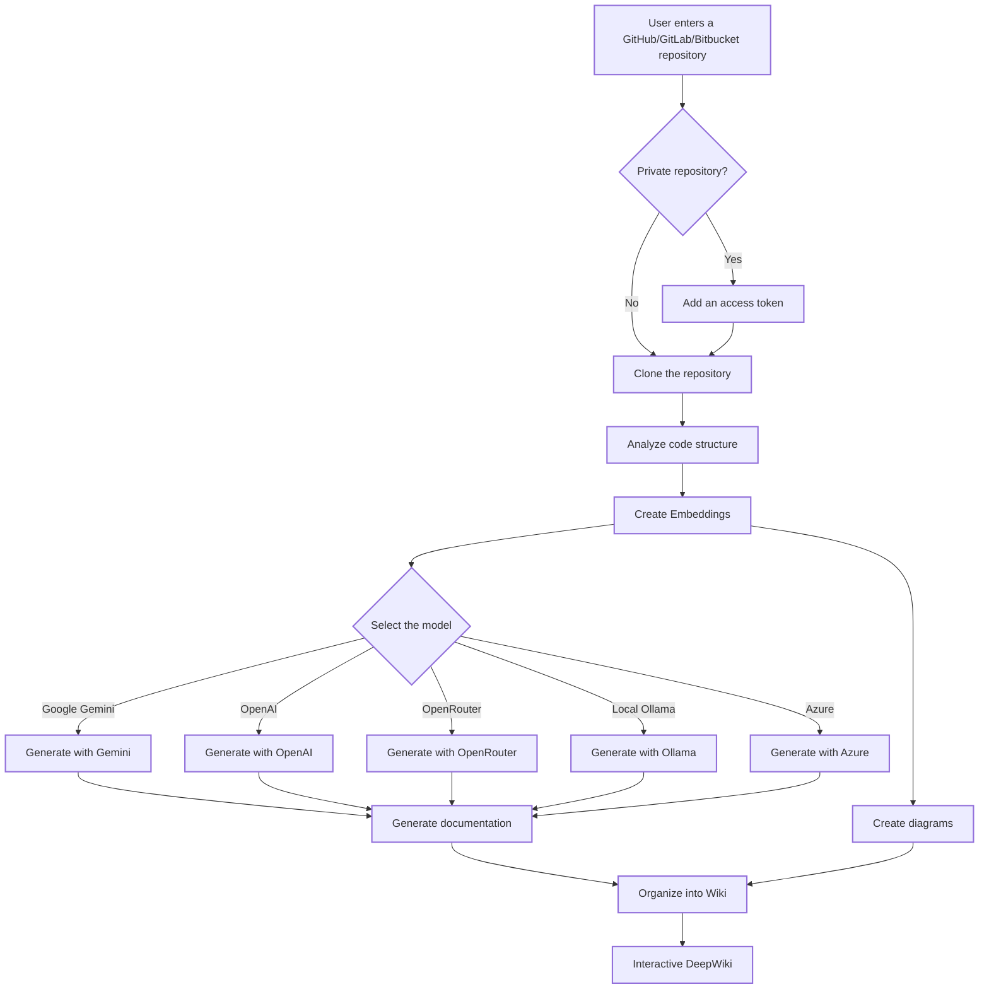

# DeepWiki-Open


**DeepWiki** is my own attempt at implementing DeepWiki, a tool that automatically creates beautiful and interactive wikis for any GitHub, GitLab, or Bitbucket repository! Simply enter a repository name, and DeepWiki:

- Analyzes the code structure
- Generates complete documentation
- Creates visual diagrams to explain how it works
- Organizes everything into an easy-to-navigate wiki

["Buy Me A Coffee"](https://buymeacoffee.com/sheing)[Tip in Crypto](https://tip.md/sng-asyncfunc)[Twitter/X](https://x.com/sashimikun_void)[Discord](https://discord.com/invite/VQMBGR8u5v)

[English](./README.md)  [简体中文](./README.zh.md)  [繁體中文](./README.zh-tw.md)  [日本語](./README.ja.md)  [Español](./README.es.md)  [한국어](./README.kr.md)  [Tiếng Việt](./README.vi.md)  [Português Brasileiro](./README.pt-br.md)  [Français](./README.fr.md)  [Русский](./README.ru.md)

## ✨ Features

- **Instant Documentation**: Turns a GitHub, GitLab, or Bitbucket repository into a wiki in seconds
- **Private Repository Support**: Secure access with personal access tokens
- **Intelligent Analysis**: AI-powered understanding of code structure and relationships
- **Elegant Diagrams**: Automatic Mermaid diagrams to visualize architecture and data flows
- **Easy Navigation**: Simple and intuitive interface
- **“Ask” Feature**: Ask questions about your repository with a RAG-powered AI
- **DeepResearch**: Multi-step research process for exploring complex topics
- **Multiple AI Model Providers**: Support for Google Gemini, OpenAI, OpenRouter, and local Ollama

## 🚀 Quick Start (Super Easy!)

### Option 1: With Docker

```bash
# Clone the repository
git clone https://github.com/AsyncFuncAI/deepwiki-open.git
cd deepwiki-open

# Create a .env file with your API keys
echo "GOOGLE_API_KEY=your_google_key" > .env
echo "OPENAI_API_KEY=your_openai_key" >> .env
# Optional: OpenRouter key
echo "OPENROUTER_API_KEY=your_openrouter_key" >> .env
# Optional: custom Ollama host
echo "OLLAMA_HOST=your_ollama_host" >> .env
# Optional: Azure OpenAI
echo "AZURE_OPENAI_API_KEY=your_azure_key" >> .env
echo "AZURE_OPENAI_ENDPOINT=your_endpoint" >> .env
echo "AZURE_OPENAI_VERSION=api_version" >> .env

# Launch with Docker Compose
docker-compose up
```

For detailed instructions on using DeepWiki with Ollama and Docker, see [Ollama Instructions](Ollama-instruction.md).

💡 **Where to get these keys:**

- Get a Google API key from [Google AI Studio](https://makersuite.google.com/app/apikey)
- Get an OpenAI API key from [OpenAI Platform](https://platform.openai.com/api-keys)
- Get Azure OpenAI credentials from [Azure Portal](https://portal.azure.com/) – create an Azure OpenAI resource and retrieve the API key, endpoint, and API version

### Option 2: Manual Installation (Recommended)

#### Step 1: Configure Your API Keys

Create a `.env` file at the project root with these keys:

```env
GOOGLE_API_KEY=your_google_key
OPENAI_API_KEY=your_openai_key
# Optional: Add this to use OpenRouter models
OPENROUTER_API_KEY=your_openrouter_key
# Optional: Add this to use Azure OpenAI models
AZURE_OPENAI_API_KEY=your_azure_openai_key
AZURE_OPENAI_ENDPOINT=your_azure_openai_endpoint
AZURE_OPENAI_VERSION=your_azure_openai_version
# Optional: Add a remote Ollama host if it is not local. Default: http://localhost:11434
OLLAMA_HOST=your_ollama_host
```

#### Step 2: Start the Backend

```bash
# Install Python dependencies
python -m pip install poetry==2.0.1 && poetry install -C api

# Start the API server
python -m api.main
```

#### Step 3: Start the Frontend

```bash
# Install JavaScript dependencies
npm install
# or
yarn install

# Start the web server
npm run dev
# or
yarn dev
```

#### Step 4: Use DeepWiki!

- Open [http://localhost:3000](http://localhost:3000) in your browser
- Enter the address of a GitHub, GitLab, or Bitbucket repository, such as `https://github.com/openai/codex`, `https://github.com/microsoft/autogen`, `https://gitlab.com/gitlab-org/gitlab`, or `https://bitbucket.org/redradish/atlassian_app_versions`
- For private repositories, click **"+ Add Access Token"** and enter your GitHub or GitLab personal access token.
- Click **"Generate Wiki"** and watch the magic happen!

## 🔍 How It Works

DeepWiki uses AI to:

- Clone and analyze the GitHub, GitLab, or Bitbucket repository, including private repositories with access-token authentication
- Create code embeddings for intelligent retrieval
- Generate documentation with context-aware AI, using Google Gemini, OpenAI, OpenRouter, Azure OpenAI, or local Ollama models
- Create visual diagrams to explain code relationships
- Organize everything into a structured wiki
- Enable intelligent question-and-answer interactions with the repository through the Ask feature
- Provide deep-research capabilities with DeepResearch



## 🛠️ Project Structure

```text
deepwiki/
├── api/                  # Backend API server
│   ├── main.py           # API entry point
│   ├── api.py            # FastAPI implementation
│   ├── rag.py            # Retrieval-Augmented Generation (RAG)
│   ├── data_pipeline.py  # Data-processing utilities
│   └── requirements.txt  # Python dependencies
│
├── src/                  # Next.js frontend application
│   ├── app/              # Next.js app directory
│   │   └── page.tsx      # Main application page
│   └── components/       # React components
│       └── Mermaid.tsx   # Mermaid diagram rendering
│
├── public/               # Static assets
├── package.json          # JavaScript dependencies
└── .env                  # Environment variables (to create)
```

## 🤖 Model Selection System

DeepWiki now implements a flexible model-selection system that supports multiple LLM providers:

### Supported Providers and Models

- **Google**: Default `gemini-2.5-flash`; also supports `gemini-2.5-flash-lite`, `gemini-2.5-pro`, etc.
- **OpenAI**: Default `gpt-5-nano`; also supports `gpt-5`, `4o`, etc.
- **OpenRouter**: Access to multiple models through a unified API, including Claude, Llama, Mistral, etc.
- **Azure OpenAI**: Default `gpt-4o`; also supports `o4-mini`, etc.
- **Ollama**: Support for locally running open-source models, such as `llama3`.

### Environment Variables

Each provider requires the corresponding API-key environment variables:

```env
# API Keys
GOOGLE_API_KEY=your_google_key        # Required for Google Gemini models
OPENAI_API_KEY=your_openai_key        # Required for OpenAI models
OPENROUTER_API_KEY=your_openrouter_key # Required for OpenRouter models
AZURE_OPENAI_API_KEY=your_azure_openai_key  # Required for Azure OpenAI models
AZURE_OPENAI_ENDPOINT=your_azure_openai_endpoint  # Required for Azure OpenAI models
AZURE_OPENAI_VERSION=your_azure_openai_version  # Required for Azure OpenAI models

# Configuration of a custom OpenAI API endpoint
OPENAI_BASE_URL=https://custom-api-endpoint.com/v1  # Optional, for custom OpenAI API endpoints

# Custom Ollama host
OLLAMA_HOST=your_ollama_host # Optional, if Ollama is not local. Default: http://localhost:11434

# Configuration directory
DEEPWIKI_CONFIG_DIR=/path/to/configuration/folder  # Optional, to customize the configuration storage directory
```

### Configuration Files

DeepWiki uses JSON configuration files to manage different aspects of the system:

1. **`generator.json`**: Text-generation model configuration
   - Defines available model providers: Google, OpenAI, OpenRouter, Azure, Ollama
   - Specifies default and available models for each provider
   - Contains model-specific parameters such as temperature and top_p

2. **`embedder.json`**: Embedding-model and text-processing configuration
   - Defines embedding models for vector storage
   - Contains retriever configuration for RAG
   - Specifies text-splitter parameters for document chunking

3. **`repo.json`**: Repository-management configuration
   - Contains file filters to exclude certain files and directories
   - Defines repository-size limits and processing rules

By default, these files are located in the `api/config/` directory. You can customize their location using the `DEEPWIKI_CONFIG_DIR` environment variable.

### Custom Model Selection for Service Providers

The custom model-selection feature is specially designed for service providers who need to:

- Offer multiple AI-model choices to users within their organization
- Quickly adapt to the rapidly evolving LLM landscape without code changes
- Support specialized or fine-tuned models that are not included in the predefined list

Service providers can implement their model offerings by selecting from predefined options or entering custom model identifiers in the user interface.

### Base URL Configuration for Private Enterprise Channels

The OpenAI client `base_url` configuration is primarily designed for enterprise users with private API channels. This feature:

- Enables connection to private or enterprise-specific API endpoints.
- Allows organizations to use their own self-hosted or custom-deployed LLM services.
- Supports integration with third-party services compatible with the OpenAI API.

**Coming soon**: In upcoming updates, DeepWiki will support a mode where users must provide their own API keys in requests. This will allow enterprise customers with private channels to use their existing API agreements without sharing their credentials with the DeepWiki deployment.

## 🧩 Using OpenAI-Compatible Embedding Models (for example, Alibaba Qwen)

If you want to use embedding models compatible with the OpenAI API, such as Alibaba Qwen, follow these steps:

- Replace the content of `api/config/embedder.json` with the content of `api/config/embedder_openai_compatible.json`.
- In your `.env` file at the project root, define the appropriate environment variables, for example:

```env
OPENAI_API_KEY=your_api_key
OPENAI_BASE_URL=your_openai_compatible_endpoint
```

- The program will automatically substitute placeholders in `embedder.json` with the values from your environment variables.

This allows you to easily switch to any OpenAI-compatible embedding service without code changes.

### Logging

DeepWiki uses Python’s built-in `logging` module for diagnostic output. You can configure verbosity and the log-file destination through environment variables:

| Variable | Description | Default Value |
|---|---|---|
| `LOG_LEVEL` | Logging level (DEBUG, INFO, WARNING, ERROR, CRITICAL). | `INFO` |
| `LOG_FILE_PATH` | Path to the log file. If set, logs will be written there. | `api/logs/application.log` |

To enable debug logging and direct logs to a custom file:

```bash
export LOG_LEVEL=DEBUG
export LOG_FILE_PATH=./debug.log
python -m api.main
```

Or with Docker Compose:

```bash
LOG_LEVEL=DEBUG LOG_FILE_PATH=./debug.log docker-compose up
```

When running with Docker Compose, the container’s `api/logs` directory is bound to `./api/logs` on your host (see the `volumes` section in `docker-compose.yml`), which ensures that log files persist across restarts.

You can also store these parameters in your `.env` file:

```env
LOG_LEVEL=DEBUG
LOG_FILE_PATH=./debug.log
```

Then simply run:

```bash
docker-compose up
```

**Security considerations regarding the log path:** In production environments, make sure the `api/logs` directory and any custom log-file path are secured with appropriate filesystem permissions and access controls. The application ensures that `LOG_FILE_PATH` is located inside the project’s `api/logs` directory to prevent path traversal or unauthorized writes.

## 🛠️ Advanced Configuration

### Environment Variables

| Variable | Description | Required | Note |
|---|---|---|---|
| `GOOGLE_API_KEY` | Google Gemini API key for generation | No | Required only if you want to use Google Gemini models |
| `OPENAI_API_KEY` | OpenAI API key for embeddings and generation | Yes | Note: This is required even if you do not use OpenAI models, because it is used for embeddings. |
| `OPENROUTER_API_KEY` | OpenRouter API key for alternative models | No | Required only if you want to use OpenRouter models |
| `AZURE_OPENAI_API_KEY` | Azure OpenAI API key | No | Required only if you want to use Azure OpenAI models |
| `AZURE_OPENAI_ENDPOINT` | Azure OpenAI endpoint | No | Required only if you want to use Azure OpenAI models |
| `AZURE_OPENAI_VERSION` | Azure OpenAI version | No | Required only if you want to use Azure OpenAI models |
| `OLLAMA_HOST` | Ollama host (default: `http://localhost:11434`) | No | Required only if you want to use an external Ollama server |
| `PORT` | API server port (default: `8001`) | No | If you host the API and frontend on the same machine, make sure to change the `SERVER_BASE_URL` port accordingly |
| `SERVER_BASE_URL` | API server base URL (default: `http://localhost:8001`) | No | |
| `DEEPWIKI_AUTH_MODE` | Set to `true` or `1` to enable locked mode | No | The default value is `false`. If enabled, `DEEPWIKI_AUTH_CODE` is required. |
| `DEEPWIKI_AUTH_CODE` | The code required for wiki generation when `DEEPWIKI_AUTH_MODE` is enabled. | No | Used only if `DEEPWIKI_AUTH_MODE` is `true` or `1`. |

If you do not use Ollama mode, you must configure an OpenAI API key for embeddings. The other API keys are required only if you configure and use models from the corresponding providers.

## Locked Mode

DeepWiki can be configured to run in locked mode, where wiki generation requires a valid authorization code. This is useful if you want to control who can use the generation feature.

It restricts frontend initialization and protects cache deletion, but it does not completely prevent backend generation if the API endpoints are reached directly.

To enable locked mode, define the following environment variables:

- `DEEPWIKI_AUTH_MODE`: set this variable to `true` or `1`. Once enabled, the interface will display an input field for the authorization code.
- `DEEPWIKI_AUTH_CODE`: set this variable to the desired secret code. It restricts frontend initialization and protects cache deletion, but does not completely prevent backend generation if the API endpoints are reached directly.

If `DEEPWIKI_AUTH_MODE` is not set or is set to `false` (or any value other than `true`/`1`), the authorization feature will be disabled and no code will be required.

### Docker Configuration

You can use Docker to run DeepWiki:

#### Running the Container

```bash
# Pull the image from GitHub Container Registry
docker pull ghcr.io/asyncfuncai/deepwiki-open:latest

# Run the container with environment variables
docker run -p 8001:8001 -p 3000:3000 \
  -e GOOGLE_API_KEY=your_google_key \
  -e OPENAI_API_KEY=your_openai_key \
  -e OPENROUTER_API_KEY=your_openrouter_key \
  -e OLLAMA_HOST=your_ollama_host \
  -e AZURE_OPENAI_API_KEY=your_azure_openai_key \
  -e AZURE_OPENAI_ENDPOINT=your_azure_openai_endpoint \
  -e AZURE_OPENAI_VERSION=your_azure_openai_version \
  -v ~/.adalflow:/root/.adalflow \
  ghcr.io/asyncfuncai/deepwiki-open:latest
```

This command also mounts `~/.adalflow` from your host to `/root/.adalflow` in the container. This path is used to store:

- Cloned repositories (`~/.adalflow/repos/`)
- Their embeddings and indexes (`~/.adalflow/databases/`)
- Cached generated wiki content (`~/.adalflow/wikicache/`)

This ensures that your data persists even if the container is stopped or removed.

You can also use the provided `docker-compose.yml` file:

```bash
# First edit the .env file with your API keys
docker-compose up
```

(The `docker-compose.yml` file is preconfigured to mount `~/.adalflow` for data persistence, similarly to the `docker run` command above.)

#### Using a `.env` File with Docker

You can also mount a `.env` file into the container:

```bash
# Create a .env file with your API keys
echo "GOOGLE_API_KEY=your_google_key" > .env
echo "OPENAI_API_KEY=your_openai_key" >> .env
echo "OPENROUTER_API_KEY=your_openrouter_key" >> .env
echo "AZURE_OPENAI_API_KEY=your_azure_openai_key" >> .env
echo "AZURE_OPENAI_ENDPOINT=your_azure_openai_endpoint" >> .env
echo "AZURE_OPENAI_VERSION=your_azure_openai_version" >> .env
echo "OLLAMA_HOST=your_ollama_host" >> .env

# Run the container with the .env file mounted
docker run -p 8001:8001 -p 3000:3000 \
  -v $(pwd)/.env:/app/.env \
  -v ~/.adalflow:/root/.adalflow \
  ghcr.io/asyncfuncai/deepwiki-open:latest
```

This command also mounts `~/.adalflow` from your host to `/root/.adalflow` in the container. This path is used to store:

- Cloned repositories (`~/.adalflow/repos/`)
- Their embeddings and indexes (`~/.adalflow/databases/`)
- Cached generated wiki content (`~/.adalflow/wikicache/`)

This ensures that your data persists even if the container is stopped or removed.

#### Building the Docker Image Locally

If you want to build the Docker image locally:

```bash
# Clone the repository
git clone https://github.com/AsyncFuncAI/deepwiki-open.git
cd deepwiki-open

# Build the Docker image
docker build -t deepwiki-open .

# Run the container
docker run -p 8001:8001 -p 3000:3000 \
  -e GOOGLE_API_KEY=your_google_key \
  -e OPENAI_API_KEY=your_openai_key \
  -e OPENROUTER_API_KEY=your_openrouter_key \
  -e AZURE_OPENAI_API_KEY=your_azure_openai_key \
  -e AZURE_OPENAI_ENDPOINT=your_azure_openai_endpoint \
  -e AZURE_OPENAI_VERSION=your_azure_openai_version \
  -e OLLAMA_HOST=your_ollama_host \
  deepwiki-open
```

#### Using Self-Signed Certificates in Docker

If you are in an environment that uses self-signed certificates, you can include them in the Docker image build:

- Create a directory for your certificates. The default directory is `certs` at the root of your project.
- Copy your `.crt` or `.pem` certificate files into that directory.
- Build the Docker image:

```bash
# Build with the default certificate directory (certs)
docker build .

# Or build with a custom certificate directory
docker build --build-arg CUSTOM_CERT_DIR=my-custom-certs .
```

### API Server Details

The API server provides:

- Repository cloning and indexing
- RAG (Retrieval-Augmented Generation)
- Streaming chat completion

For more details, see the [API README](./api/README.md).

## 🔌 OpenRouter Integration

DeepWiki now supports [OpenRouter](https://openrouter.ai/) as a model provider, giving you access to hundreds of AI models through a single API:

- **Multiple model options**: Access models from OpenAI, Anthropic, Google, Meta, Mistral, and more
- **Simple configuration**: Simply add your OpenRouter API key and select the model you want to use
- **Cost effectiveness**: Choose models that match your budget and performance needs
- **Easy switching**: Switch between different models without changing your code

### How to Use OpenRouter with DeepWiki

- **Get an API key**: Sign up on [OpenRouter](https://openrouter.ai/) and get your API key
- **Add to the environment**: Add `OPENROUTER_API_KEY=your_key` to your `.env` file
- **Enable in the user interface**: Check the **"Use OpenRouter API"** option on the home page
- **Select the model**: Choose from popular models such as GPT-4o, Claude 3.5 Sonnet, Gemini 2.0, and more

OpenRouter is particularly useful if you want to:

- Try different models without signing up for multiple services
- Access models that may be restricted in your region
- Compare performance across different model providers
- Optimize the cost/performance ratio based on your needs

## 🤖 Ask & DeepResearch Features

### Ask Feature

The Ask feature allows you to chat with your repository using Retrieval-Augmented Generation (RAG):

- **Context-aware answers**: Get accurate answers based on the actual code in your repository
- **Powered by RAG**: The system retrieves relevant code snippets to provide grounded answers
- **Real-time streaming**: View answers as they are generated for a more interactive experience
- **Conversation history**: The system keeps context between questions for more coherent interactions

### DeepResearch Feature

DeepResearch takes repository analysis to the next level with a multi-step research process:

- **In-depth investigation**: Deeply explores complex topics through multiple research iterations
- **Structured process**: Follows a clear research plan with updates and a complete conclusion
- **Automatic continuation**: The AI automatically continues the research until it reaches a conclusion, up to 5 iterations
- **Research steps**:
  - **Research plan**: Describes the approach and initial conclusions
  - **Research updates**: Builds on previous iterations with new information
  - **Final conclusion**: Provides a complete answer based on all iterations

To use DeepResearch, simply enable the **"Deep Research"** toggle in the Ask interface before submitting your question.

## 📱 Screenshots

[DeepWiki main interface](screenshots/Interface.png)
_The main DeepWiki interface_

[Private repository support](screenshots/privaterepo.png)
_Access private repositories with personal access tokens_

[DeepResearch feature](screenshots/DeepResearch.png)
_DeepResearch performs multi-step research for complex topics_

### Demo Video

[DeepWiki demo video](https://youtu.be/zGANs8US8B4)

_Watch DeepWiki in action!_

## ❓ Troubleshooting

### API Key Issues

- **"Missing environment variables"**: Make sure your `.env` file is located at the project root and contains the required API keys.
- **"Invalid API key"**: Verify that you copied the complete key correctly, without extra spaces.
- **"OpenRouter API error"**: Check that your OpenRouter API key is valid and has sufficient credits.
- **"Azure OpenAI API error"**: Check that your Azure OpenAI credentials, API key, endpoint, and version are correct and that the service is properly deployed.

### Connection Issues

- **"Unable to connect to the API server"**: Make sure the API server is running on port `8001`.
- **"CORS error"**: The API is configured to allow all origins, but if you encounter issues, try running the frontend and backend on the same machine.

### Generation Issues

- **"Error while generating the wiki"**: For very large repositories, try a smaller repository first.
- **"Invalid repository format"**: Make sure you use a valid GitHub, GitLab, or Bitbucket URL format.
- **"Unable to retrieve repository structure"**: For private repositories, make sure you entered a valid personal access token with the appropriate permissions.
- **"Diagram rendering error"**: The application will automatically try to fix broken diagrams.

### Common Solutions

- **Restart both servers**: Sometimes a simple restart resolves most issues.
- **Check console logs**: Open the browser developer tools to view JavaScript errors.
- **Check API logs**: Check the terminal where the API is running for Python errors.

## 🤝 Contribution

Contributions are welcome! Feel free to:

- Open issues for bugs or feature requests
- Submit pull requests to improve the code
- Share your comments and ideas

## 📄 License

Project licensed under MIT – See the [LICENSE](LICENSE) file.

## ⭐ Star History

[Star History](https://star-history.com/#AsyncFuncAI/deepwiki-open&Date)
