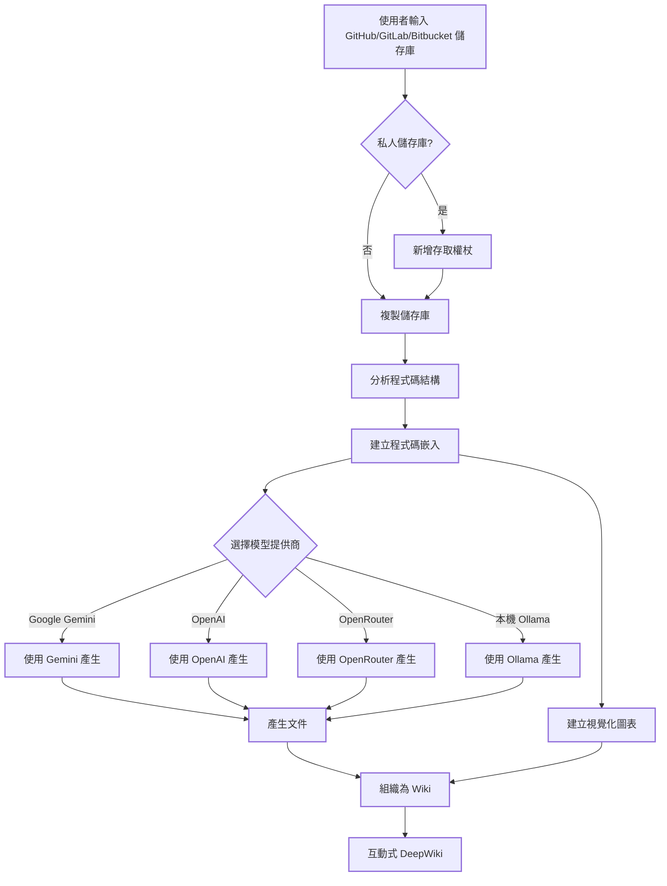

# DeepWiki-Open


**DeepWiki** 可以為任何 GitHub、GitLab 或 BitBucket 程式碼儲存庫自動建立美觀、互動式的 Wiki！只需輸入儲存庫名稱，DeepWiki 將：

1. 分析程式碼結構
2. 產生全面的文件
3. 建立視覺化圖表解釋一切如何運作
4. 將所有內容整理成易於導覽的 Wiki

[](https://buymeacoffee.com/sheing)

[](https://x.com/sashimikun_void)
[](https://discord.com/invite/VQMBGR8u5v)

[English](./README.md) | [简体中文](./README.zh.md) | [繁體中文](./README.zh-tw.md) | [日本語](./README.ja.md) | [Español](./README.es.md) | [한국어](./README.kr.md) | [Tiếng Việt](./README.vi.md)

## ✨ 特點

- **即時文件**：幾秒鐘內將任何 GitHub、GitLab 或 BitBucket 儲存庫轉換為 Wiki
- **私人儲存庫支援**：使用個人存取權杖安全存取私人儲存庫
- **智慧分析**：AI 驅動的程式碼結構和關係理解
- **精美圖表**：自動產生 Mermaid 圖表視覺化架構和資料流
- **簡易導覽**：簡單、直觀的介面探索 Wiki
- **提問功能**：使用 RAG 驅動的 AI 與您的儲存庫聊天，取得準確答案
- **深度研究**：多輪研究過程，徹底調查複雜主題
- **多模型提供商**：支援 Google Gemini、OpenAI、OpenRouter 和本機 Ollama 模型

## 🚀 快速開始（超級簡單！）

### 選項 1：使用 Docker

```bash
# 複製儲存庫
git clone https://github.com/AsyncFuncAI/deepwiki-open.git
cd deepwiki-open

# 建立包含 API 金鑰的 .env 檔案
echo "GOOGLE_API_KEY=your_google_api_key" > .env
echo "OPENAI_API_KEY=your_openai_api_key" >> .env
# 可選：如果您想使用 OpenRouter 模型，新增 OpenRouter API 金鑰
echo "OPENROUTER_API_KEY=your_openrouter_api_key" >> .env

# 使用 Docker Compose 執行
docker-compose up
```

(上述 Docker 命令以及 `docker-compose.yml` 設定會掛載您主機上的 `~/.adalflow` 目錄到容器內的 `/root/.adalflow`。此路徑用於儲存：
- 複製的儲存庫 (`~/.adalflow/repos/`)
- 儲存庫的嵌入和索引 (`~/.adalflow/databases/`)
- 快取的已產生 Wiki 內容 (`~/.adalflow/wikicache/`)

這確保了即使容器停止或移除，您的資料也能持久保存。)

> 💡 **取得這些金鑰的地方：**
> - 從 [Google AI Studio](https://makersuite.google.com/app/apikey) 取得 Google API 金鑰
> - 從 [OpenAI Platform](https://platform.openai.com/api-keys) 取得 OpenAI API 金鑰

### 選項 2：手動設定（推薦）

#### 步驟 1：設定 API 金鑰

在專案根目錄建立一個 `.env` 檔案，包含以下金鑰：

```
GOOGLE_API_KEY=your_google_api_key
OPENAI_API_KEY=your_openai_api_key
# 可選：如果您想使用 OpenRouter 模型，新增此項
OPENROUTER_API_KEY=your_openrouter_api_key
```

#### 步驟 2：啟動後端

```bash
# 安裝 Python 相依性
pip install -r api/requirements.txt

# 啟動 API 伺服器
python -m api.main
```

#### 步驟 3：啟動前端

```bash
# 安裝 JavaScript 相依性
npm install
# 或
yarn install

# 啟動 Web 應用
npm run dev
# 或
yarn dev
```

#### 步驟 4：使用 DeepWiki！

1. 在瀏覽器中開啟 [http://localhost:3000](http://localhost:3000)
2. 輸入 GitHub、GitLab 或 Bitbucket 儲存庫（如 `https://github.com/openai/codex`、`https://github.com/microsoft/autogen`、`https://gitlab.com/gitlab-org/gitlab` 或 `https://bitbucket.org/redradish/atlassian_app_versions`）
3. 對於私人儲存庫，點擊「+ 新增存取權杖」並輸入您的 GitHub 或 GitLab 個人存取權杖
4. 點擊「產生 Wiki」，見證奇蹟的發生！

## 🔍 工作原理

DeepWiki 使用 AI 來：

1. 複製並分析 GitHub、GitLab 或 Bitbucket 儲存庫（包括使用權杖驗證的私人儲存庫）
2. 建立程式碼嵌入用於智慧檢索
3. 使用上下文感知 AI 產生文件（使用 Google Gemini、OpenAI、OpenRouter 或本機 Ollama 模型）
4. 建立視覺化圖表解釋程式碼關係
5. 將所有內容組織成結構化 Wiki
6. 透過提問功能實現與儲存庫的智慧問答
7. 透過深度研究功能提供深入研究能力



## 🛠️ 專案結構

```
deepwiki/
├── api/                  # 後端 API 伺服器
│   ├── main.py           # API 進入點
│   ├── api.py            # FastAPI 實作
│   ├── rag.py            # 檢索增強產生
│   ├── data_pipeline.py  # 資料處理工具
│   └── requirements.txt  # Python 相依性
│
├── src/                  # 前端 Next.js 應用
│   ├── app/              # Next.js 應用目錄
│   │   └── page.tsx      # 主應用頁面
│   └── components/       # React 元件
│       └── Mermaid.tsx   # Mermaid 圖表渲染器
│
├── public/               # 靜態資源
├── package.json          # JavaScript 相依性
└── .env                  # 環境變數（需要建立）
```

## 🤖 提問和深度研究功能

### 提問功能

提問功能允許您使用檢索增強產生（RAG）與您的儲存庫聊天：

- **上下文感知回應**：基於儲存庫中實際程式碼取得準確答案
- **RAG 驅動**：系統檢索相關程式碼片段，提供有根據的回應
- **即時串流傳輸**：即時檢視產生的回應，取得更互動式的體驗
- **對話歷史**：系統在問題之間保持上下文，實現更連貫的互動

### 深度研究功能

深度研究透過多輪研究過程將儲存庫分析提升到新水平：

- **深入調查**：透過多次研究迭代徹底探索複雜主題
- **結構化過程**：遵循清晰的研究計畫，包含更新和全面結論
- **自動繼續**：AI 自動繼續研究直到達成結論（最多 5 次迭代）
- **研究階段**：
  1. **研究計畫**：概述方法和初步發現
  2. **研究更新**：在前一輪迭代基礎上增加新見解
  3. **最終結論**：基於所有迭代提供全面答案

要使用深度研究，只需在提交問題前在提問介面中切換「深度研究」開關。

## 📱 螢幕截圖

### 主頁面


### Wiki 頁面


### 提問功能


### 深度研究


## 🔧 配置選項

### 模型提供商

DeepWiki 支援多個 AI 模型提供商：

1. **Google Gemini**（預設）
   - 快速且經濟實惠
   - 良好的程式碼理解能力

2. **OpenAI**
   - 高品質輸出
   - 支援 GPT-4 和 GPT-3.5

3. **OpenRouter**
   - 存取多個模型
   - 靈活的定價選項

4. **本機 Ollama**
   - 隱私保護
   - 離線運行
   - 需要本機設定

### Wiki 類型

- **全面型**：包含詳細分析、程式碼範例和完整文件
- **簡潔型**：專注於核心功能和關鍵見解

## 🌍 支援的平台

- **GitHub**：公開和私人儲存庫
- **GitLab**：GitLab.com 和自主託管實例
- **Bitbucket**：Atlassian 託管的儲存庫

## 📚 API 端點

### `/api/wiki_cache`
- **方法**：GET
- **描述**：檢索快取的 Wiki 資料
- **參數**：
  - `repo`: 儲存庫識別符
  - `platform`: git 平台（github、gitlab、bitbucket）

### `/export/wiki`
- **方法**：GET
- **描述**：匯出 Wiki 為 Markdown 或 JSON
- **參數**：
  - `repo`: 儲存庫識別符
  - `format`: 匯出格式（markdown、json）

## 🤝 貢獻

我們歡迎各種形式的貢獻！無論是錯誤報告、功能請求還是程式碼貢獻。

### 開發設定

1. Fork 此儲存庫
2. 建立功能分支：`git checkout -b feature/amazing-feature`
3. 提交您的變更：`git commit -m 'Add amazing feature'`
4. 推送到分支：`git push origin feature/amazing-feature`
5. 開啟 Pull Request

### 新增新語言支援

1. 在 `src/messages/` 中新增新的翻譯檔案
2. 更新 `src/i18n.ts` 中的 `locales` 陣列
3. 建立相對應的 README 檔案
4. 測試翻譯

## 📄 授權

此專案根據 MIT 授權條款授權 - 詳情請參閱 [LICENSE](LICENSE) 檔案。

## 🙏 致謝

- 感謝所有貢獻者的努力
- 基於 Next.js、FastAPI 和各種開源程式庫建構
- 特別感謝 AI 模型提供商讓此專案成為可能

## 🐛 問題回報

如果您遇到任何問題，請在 GitHub Issues 中建立問題報告。請包含：

- 錯誤描述
- 重現步驟
- 預期行為
- 螢幕截圖（如果適用）
- 系統資訊

## 🔮 未來計劃

- [ ] 更多 AI 模型整合
- [ ] 進階程式碼分析功能
- [ ] 即時協作編輯
- [ ] 行動應用支援
- [ ] 企業級功能

---

由 [Sheing Ng](https://github.com/sheing) 用 ❤️ 建立 